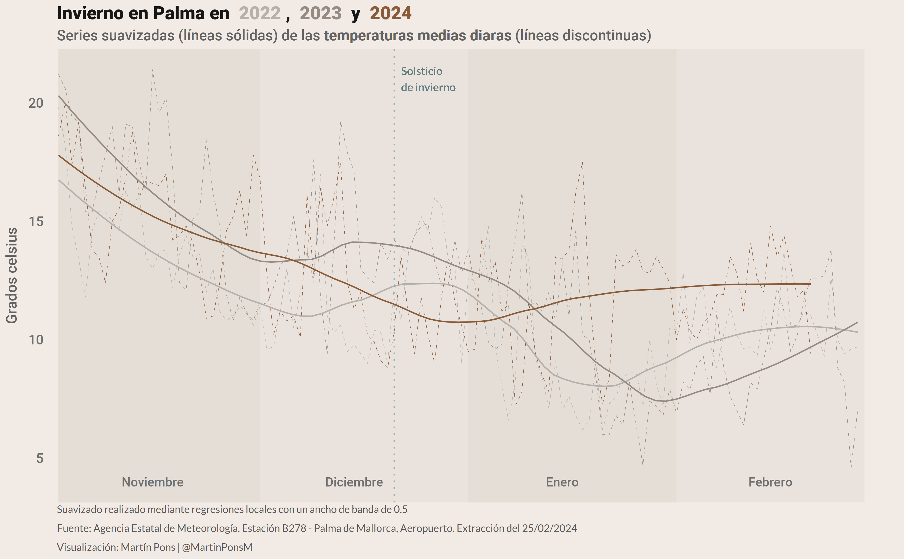

# Invierno en Palma en 2022, 2023 y 2024

Este repositorio contiene una visualización que compara las temperaturas anormalmente altas de enero y febrero de 2024 con las de los dos inviernos anteriores.

Los datos han sido obtenidos de la [Agencia Estatal de Meteorologí](https://www.aemet.es/es/portada), y extraidos el 25 de febrero de 2024

